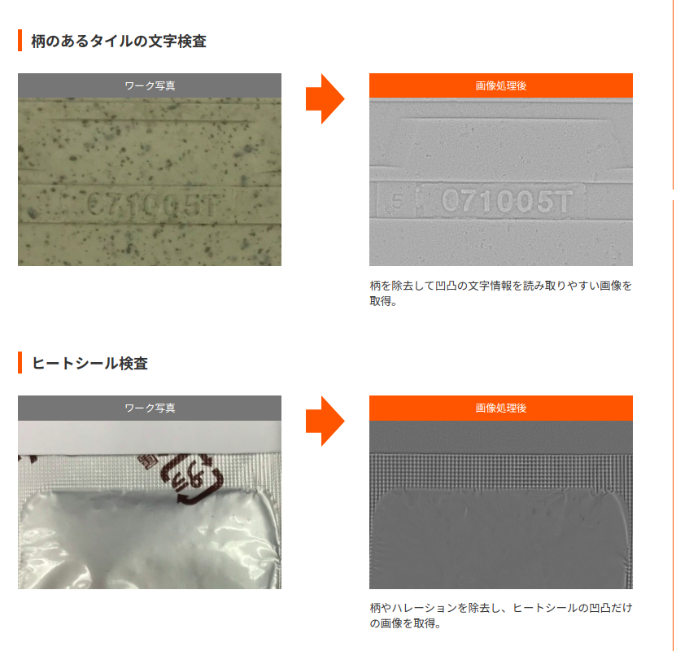

# 代表的なタスク
- 物体検出
  - 特定のカテゴリーでの物体検出から、open vocabularyでの物体検出に移行しつつあります。
  - 特定カテゴリーでの物体検出にはYOLOシリーズが代表的な実装です。
- セグメンテーション
- インスタンスセグメンテーション
- 属性分類
  - 顔の属性推定が有名です。
  - 年齢・性別・表情
  - 商用の顔ライブラリの場合だと、顔の属性推定を含んでいます。
- 姿勢推定
  - PapersWithCode [Pose Estimation](https://paperswithcode.com/task/pose-estimation)
  - https://github.com/stereolabs/zed-sdk/tree/master/body%20tracking
- 顔照合・人物推定(re-identification)
  - 顔照合は、マスク顔対応が終わった時点で、技術分野としては枯れた技術になりつつあります。（黒人対応はありますが）
  - 利用予定のプラットフォームにある実装をまず調査してください。
  - 対応OS,対応言語、依存ライブラリのバージョン、GPUなどのアクセラレータ対応の状況、今後のサポートの状況などを調査してください。
  - 利用予定のカメラと想定しているユースケースでの顔画像を使って、評価します。
- 人物の属性分析
  - ヘアスタイル
  - 着衣領域のセグメンテーション
  - バッグなどの有無、キャリーケースの有無
  - 着衣の分類
  - 着衣から指定される性別
  - 杖の有無
  - 車椅子
  これらの人物の属性分析もある。
- open vocabulary での物体検出
- https://github.com/NVIDIA-AI-IOT/nanosam
PapersWithCode [Open Vocabulary Object Detection](https://paperswithcode.com/task/open-vocabulary-object-detection)

[Open vocabulary object detection with NVIDIA Grounding-DINO](https://www.nvidia.com/ja-jp/on-demand/session/other2024-tao55gdino/)

- open vocabulary でのセグメンテーション
- PapersWithCode [Open Vocabulary Semantic Segmentation](https://paperswithcode.com/task/open-vocabulary-semantic-segmentation)
- 人に関係するさまざまな画像認識
- 人と接するロボットの場合、人認識に関連して複数の情報を取得しなくちゃならない。
- 従来は、それを別個のタスクとして行い、それを統合しようとしてきた。
- 最近は、それらを１つのモデルによって推論しつくそうとする実装が登場している。
- https://x.com/PINTO03091/status/1974767571871453353
- 利点：
  - 同期された出力がでるので、時刻差がないのでつじつまのあった解釈が可能である。
  - 複数の出力を作る際に必要になる中間情報が共通であるので、出力結果の整合性が得やすい。
  - いったん、そのようなモデルの枠組みができれば、フレームワークを変更するのも簡単になる。
- 難点：
  - そのような高い整合性と一貫性をもつデータセットの作成が厖大な手間であること。
  - 成功するかどうかわかっていない時点では、その作戦で開発を推進して、全滅になる可能性もあるということ。
  - 従来のアノテーションや今までに自分がしたアノテーションをつけ直すという決断をしてやり切ることが必要になること。
## 動画解析
- 人物の行動分析
  - 立ち入り禁止領域の人物検出
  - 走っている人物の検出
  - 人流計測
  - 不審動作の発見

## 自律移動ロボットでよくあるタスク
- SLAM
- 自己位置推定
- 経路計画

### 最近出てきた・増えてきた画像認識タスク
##### 3D Semantic Segmentation
PapersWithCode [3D Semantic Segmentation](https://paperswithcode.com/task/3d-semantic-segmentation)

[3D Object Detection From Stereo Images](https://paperswithcode.com/task/3d-object-detection-from-stereo-images)

##### affordance の検出
##### 物体の検出にともなうハンドによる把持動作の生成に近い分野

- PapersWithCode [Grasp Generation](https://paperswithcode.com/task/grasp-generation)
- PapersWithCode [hand-object pose](https://paperswithcode.com/task/hand-object-pose)
- PapersWithCode [3D Canonical Hand Pose Estimation](https://paperswithcode.com/task/3d-canonical-hand-pose-estimation)

##### 多視点カメラ画像による物体の理解
  - 従来は、カメラパラメータが違う多数のweb画像で特定の建築物を復元するようなものが多かった。
    - 組み込み可能性は考えない。
  - 今は、一つのカメラから視点位置を変えて、特定物を見て、形状復元するのが増えてきている。
    - 組み込み可能性を気にしだしている。

PapersWithCode [3D Reconstruction](https://paperswithcode.com/task/3d-reconstruction)

##### Visual Question Answering (VQA)
- PapersWithCode [Visual Question Answering (VQA)](https://paperswithcode.com/task/visual-question-answering)

#### VLA(vision language action)
視覚と言語の入力があって、動作を生成するタスクとして定義される。
例：視覚を含む各種センサデータ、運転についての指示がある状況で、自律運転車の動作を生成するタスク
このなかでは、人検出などの物体検出・周辺環境のセグメンテーションもVLAのend-to-end の中に隠れたタスクとなる。

## 大規模言語モデルは、避けて通れない
#### PC・クラウドサービスでの推論
主に国内の動向から

[Heron A Library for Vision / Video and Language models](https://github.com/turingmotors/heron)

#### 組み込みデバイスでの推論

[Openな資産とFPGAを活用して、領域特化型のProcessorを作ろう！](https://www.docswell.com/s/TIER_IV/ZG6LJK-2022-04-26-162717)

github [Swan A Lightweight Language Model Execution Environment Using FPGA](https://github.com/turingmotors/swan)
[言語モデルを高位合成でFPGAに実装してみた](https://zenn.dev/turing_motors/articles/82505880d27d65)

## それはほんとうにVisionのタスクなのか
- 例：ばら積みのボルト・ナットをロボットのハンドでつかませて、持ち直して、取り付ける。
- このうち、バラ積みのボルトがあるのを見つけるまではビジョンだと思う。
- しかし、そこから一つをつかみだし、持ち直すのは、圧倒的にタッチとタッチに基づく行動計画だと思う。
- 参照例：　https://www.thinker-robotics.co.jp/product/robot-hand-f.html

## 物体としての2次元画像の理解
- CNNに代表される物体検出のロジックでは、2次元画像としての理解のままとどまり、その背後にある空間の認識がない。
- 例：YOLOの物体検出
- https://pjreddie.com/darknet/yolo/horses.png
- boundingbox は画像上の位置に過ぎない。
- 含んでいないもの：
- 奥行き情報、物体の前後関係
- 物体までの距離、地面・床面での接地位置
- 物体の大きさ
- 物体表面の向きに関する情報

これらの情報が欠落している。

ロボットが認識して行動をおこすには、空間情報としての理解が必要になる。

フォトメトリックステレオ法
https://seeds.nii.ac.jp/researcher-files/ikehata
https://openaccess.thecvf.com/content_ECCV_2018/papers/Ikehata_CNN-PS_CNN-based_Photometric_ECCV_2018_paper.pdf

フォトメトリックステレオ法による外観検査の撮像事例
https://www.ccs-inc.co.jp/solution/case/ap_photometric_stereo.html

照度差ステレオの原理と実際
https://annex.jsap.or.jp/photonics/kogaku/public/41-05-kaisetsu4.pdf

https://github.com/visiont3lab/photometric_stereo

https://github.com/tomykaira/photometric-stereo

単眼ステレオの実装は、フォトメトリックステレオという言葉を使わない表現で実装が進んでいる。

DepthAnything の実装がその一つである。
それらの実装からでも、法線ベクトルの向きなどの情報を取得することができる。

法線ベクトルのデータを含めて、RGBデータと一緒に推論を行うのはどうだろう。
物体形状についての理解が支援された状況での推論となる
その分、目的の精度は達せしやすくなるだろう。

アクティブサンプリングするスコア領域の範囲を未検出率１０％に相当する領域に集中させたらどうなるだろう。
