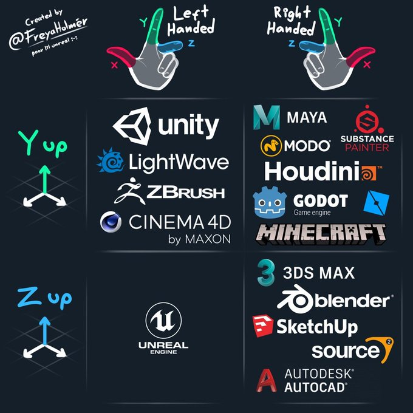

# 座標系の問題

## アプリケーションごとの座標系の違い
空間座標を取り扱う段階になると、アプリケーションごとに座標系の定義が異なるという問題に直面する。

https://pbs.twimg.com/media/GZAINdAbAAU09fW?format=jpg&name=small

### ZED SDK の場合の座標系の設定
[Selecting a Coordinate System](https://www.stereolabs.com/docs/positional-tracking/coordinate-frames)
デフォルトの座標系
ｘ：左から右
y：上から下
Z:カメラから前方へ

InitParameters.coordinate_system の値を変更することで、
６通りの定義を切り替えることができる。

